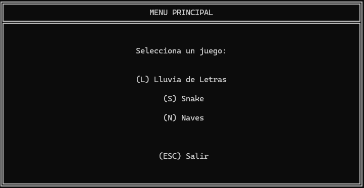
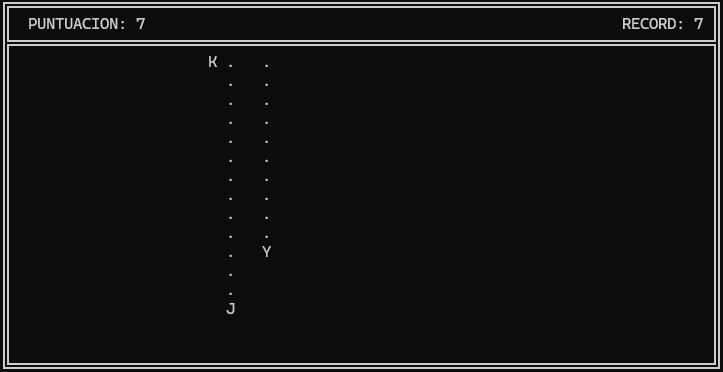
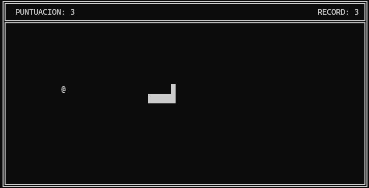
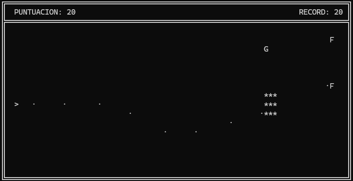

# Mini Game Engine

> An early C++ project, a small console game engine with three games built on top of it: typing rain, Snake, and a space shooter. Written while I was learning the language, uploaded essentially as-is (a couple of broken `main.cpp` files in the standalone projects fixed so the code compiles cleanly, no other changes), an honest snapshot of where I was as a C++ developer at the time.

<p align="center">
  <a href="youtubeurl...coming...">
    
  </a>
</p>

<p align="center">
  
  
  
</p>

## About this repository

This was my first proper C++ project. The goal wasn't really to ship three games, it was to figure out whether I could design a small reusable engine and then prove it by plugging different games into the same core through a common interface. Three games came out the other end, but the part I'm proud of is the engine, not the games themselves.

The code has rough edges, decisions I wouldn't make today, and patterns I'd factor out without thinking twice. **It's uploaded essentially as-is**, untouched apart from the two compile fixes mentioned above, because this repo isn't here to showcase "clean code." It's here to show two things:

- that I was able to design and build a working engine abstraction, with three different games actually plugging into it,
- and that today I can look at the code with a critical eye and point to exactly what's wrong with it.

That second part is documented below, in [Technical debt and decisions I'd revisit](#technical-debt-and-decisions-id-revisit) and [What I'd do differently today](#what-id-do-differently-today).

## What's inside

### The engine

The part of this repo I actually care about.

- **Interface-driven game registration.** Games implement `IGame` (`Reset`, `Update(dt, input)`, `Draw(drawManager)`, score accessors) and are plugged into the engine via `engine.RegisterGame(key, name, gamePtr)`. The launcher menu is built dynamically from whatever's registered, adding a fourth game means writing the game class and one extra `RegisterGame` line. The engine never has to know what kind of game it's running.
- **Frame-buffered console rendering.** `DrawManager` writes every cell to an in-memory `char` matrix and flushes the whole frame in a single `std::cout` write, which is what kills the flicker you usually get from naive console games.
- **Fixed-timestep loop.** `TimeManager::shouldExecuteNextFrame()` gates `Update` and `Draw` so the game runs at a configured FPS regardless of how fast the main loop spins.
- **Input with edge detection.** `InputManager` distinguishes *held* keys (`IsKeyPressed`) from *just pressed* keys (`IsKeyJustPressed`), which matters for menu selection and for any toggle action that shouldn't fire every frame.

### The games

- **Lluvia de Letras**, letters fall from the top of the screen, you type them before they reach the bottom. A `DifficultyManager` ramps spawn rate and fall speed over time. Some letters are shielded and need multiple hits. Has trail and explosion effects.
- **Snake**, classic snake on a grid, arrow keys or WASD. Tail collision detection, food spawning that avoids occupied cells.
- **Naves**, horizontal scroller with player ship, auto-firing bullets, enemies, and explosion effects. **Enemy waves are configured from an external `waves.xml` file** parsed with [tinyxml2](https://github.com/leethomason/tinyxml2). When all waves finish, the cycle restarts with scaled-up speed, HP and points for replayability. Best score is persisted to `naves_record.txt` between runs.

`NavesGame` is the one that pushed me the most. It has a small actor system: `Objeto → Actor → PlayerShip / EnemyShip / Bullet / ExplosionEffect`, with an `ActorTag` enum for collision dispatch, and a deferred-add queue (`pendingAdd`) so that new actors spawned during `Update` don't invalidate the iteration. I'm still happy with that piece.

## How to build it

You'll need **Visual Studio 2019 or newer** on **Windows**. The engine uses the Win32 Console API (`<windows.h>`, `GetStdHandle`, `Sleep`, `GetAsyncKeyState`), so it won't compile out of the box on Linux or macOS.

1. Open the `.sln` in Visual Studio.
2. Set **`Launcher`** as the startup project.
3. Build (`Ctrl+Shift+B`) and run (`F5`).

Make sure `waves.xml` is in the working directory when `Naves` runs, otherwise the game starts with no enemies. `naves_record.txt` is created automatically on first play.

## Controls

| Action | Key |
|---|---|
| Select game from menu | `L` / `S` / `N` |
| Exit | `Esc` |
| Return to menu (on game over) | `M` |
| Restart current game (on game over) | `R` |

Per-game:

- **Lluvia de Letras**, type the letters as they fall.
- **Snake**, `↑ ↓ ← →` or `W A S D`.
- **Naves**, `↑ ↓` or `W S` to move vertically. The ship auto-fires.

## Project structure

```
mini-game-engine/
├── GameEngine/          # Reusable engine: IGame interface + managers
│   ├── IGame.h
│   ├── GameEngine.{h,cpp}
│   ├── DrawManager.{h,cpp}
│   ├── InputManager.{h,cpp}
│   └── TimeManager.{h,cpp}
├── Launcher/            # Single entry point that registers all 3 games
│   └── main.cpp
├── LluviaGame/
├── SnakeGame/
└── NavesGame/           # Also bundles tinyxml2 and waves.xml
```

## Technical debt and decisions I'd revisit

I've reviewed this with hindsight. I'm listing the issues not to make excuses, but to make the point that **I can identify them now**, which is the actual skill that matters.

- **Raw `new`/`delete` everywhere.** `GameEngine` owns three managers (`TimeManager*`, `DrawManager*`, `InputManager*`) as raw pointers with manual `new` in the constructor and `delete` in the destructor. There's no reason for them to be pointers at all, they could be value members. Failing that, `std::unique_ptr` would have given the same lifetime guarantees without the boilerplate.
- **Manual actor lifetime in NavesGame.** `std::list<Actor*>` with `delete` loops in `DestroyAllActors()`. A `std::list<std::unique_ptr<Actor>>` removes the entire ownership question.
- **Reinventing `strlen` inline.** `DrawMenu()` has loops like `for (int i = 0; title[i] != '\0'; i++) titleLen++;` to compute string lengths. That's `strlen`, or better, `std::string::length()` if the menu used `std::string` throughout (which it should).
- **`sprintf_s` is Microsoft-specific.** `snprintf` is standard and portable. Doesn't matter here because the project is Windows-only anyway, but it's the kind of thing that makes a project gratuitously non-portable.
- **C-style `char[]` arrays in the menu code** where `std::string` would have been clearer and shorter.
- **Hardcoded relative paths in `Launcher/main.cpp`** (`"waves.xml"`, `"naves_record.txt"`). If the executable is run from a directory other than the one containing those files, Naves silently misbehaves. Should resolve them relative to the executable's own location.
- **`Reset()` was being called twice in a row in `GameEngine::Start()`** before I cleaned it up for this commit. Inert (the second call did nothing meaningful), but symptomatic of code that wasn't being re-read carefully.

## What I'd do differently today

If I were rewriting this from scratch:

1. **`std::unique_ptr` for any owned resource**, value semantics for everything that can be a value. No raw `new`/`delete` outside of the few places where they're genuinely necessary.
2. **Abstract the platform layer behind an interface** (`IPlatform` with `ClearScreen`, `Sleep`, `IsKeyPressed`, etc.) so that `windows.h` only appears in one file. That alone would make a Linux port a one-evening job.
3. **Replace `IGame::Update(dt, input)` with a richer contract** where the game returns *events* (e.g., `GameOver{}`, `ScoreChanged{newScore}`) instead of the engine polling its state. Cleaner separation, easier to test.
4. **A small entity-component system in NavesGame** instead of the inheritance hierarchy. The actor classes already lean that way (tags, deferred adds) but using virtual functions rather than composition.
5. **Compile-time game registration** with a templated registry, so adding a new game doesn't require touching `Launcher/main.cpp` at all.
6. **Tests around the pure logic**: collision detection, score accumulation, wave progression in `WaveManager`. None of this requires a console to test.

None of this is going to be applied to this repo. It is what it is, and that's the point of keeping it public.

## Stack

- **Language:** C++ (project is configured for C++14, no significant use of newer features)
- **Build:** Visual Studio 2019+ (MSVC), Windows only
- **Third-party:** [tinyxml2](https://github.com/leethomason/tinyxml2) for parsing `waves.xml`

## Third-party

The code is mine. The one external dependency is:

- **[tinyxml2](https://github.com/leethomason/tinyxml2)** by Lee Thomason, used by `NavesGame` to load wave configurations from XML. Bundled as source under `NavesGame/tinyxml2.{h,cpp}`. Licensed under the zlib license, kept verbatim alongside the source files.

## License

MIT, see [LICENSE](LICENSE).

---

*If you made it this far: thanks for taking a look. If you find a bug, want to comment on the code, or just tell me how you'd have done it, open an issue. I'd genuinely love to hear about it.*